# CIS 5660 HW03 Procedural Buildings

## Project Overview
In this project, I have used Houdini to create a multi-level building generator.

## Overview 
Here is a screenshot of my procedural building:
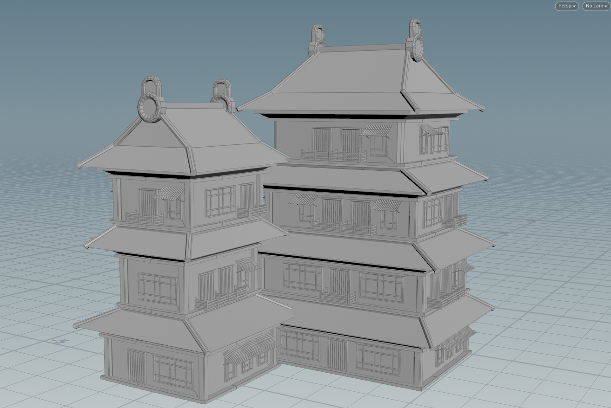

The style of the building was inspired from some concept art of Japanese style buildings:
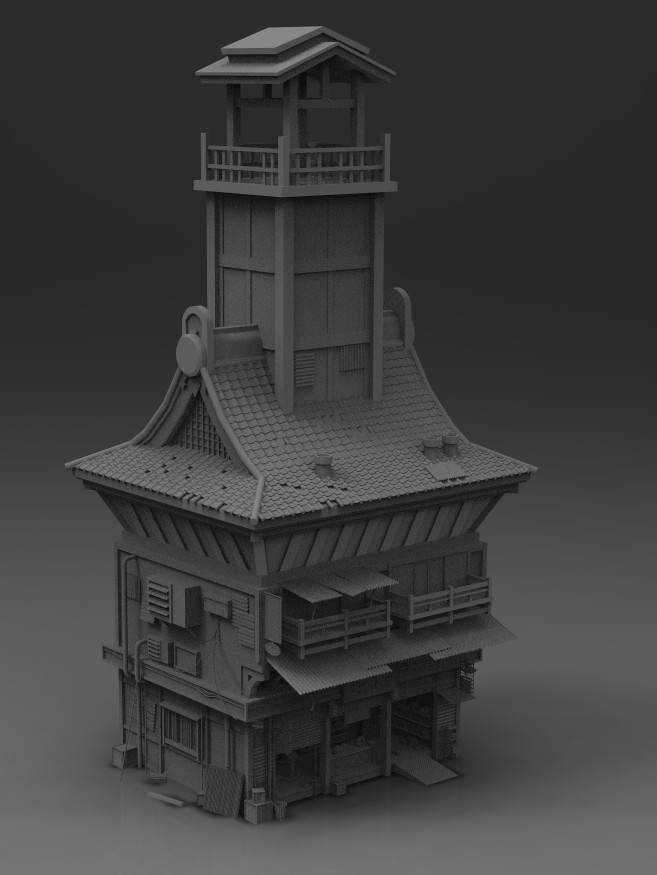
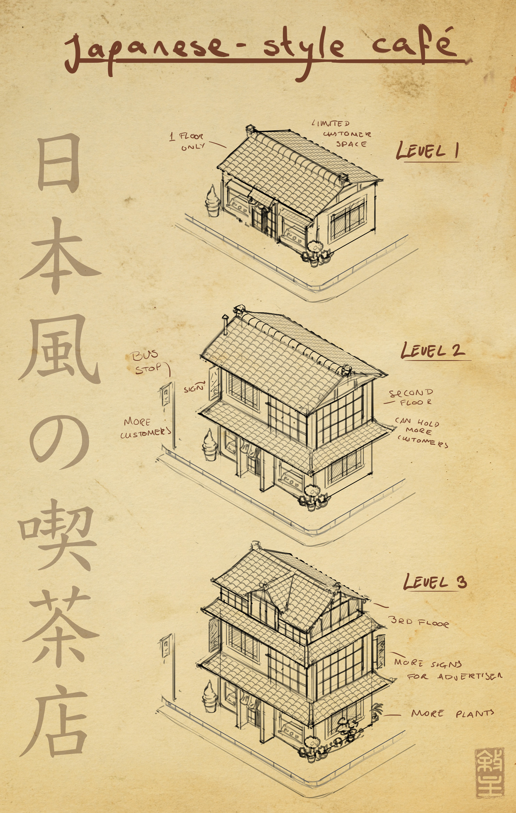

## Features
### Levels
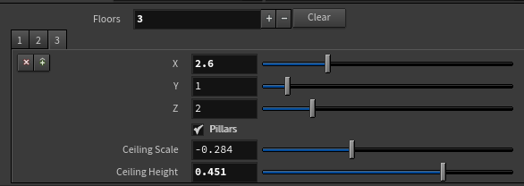

For each level, the users could control the basic size of the building block, whether to have pillars, and the size of the ceiling.

### Balcony
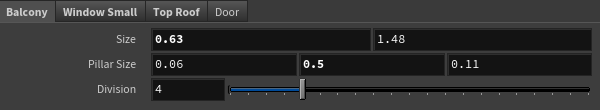

For the balcony part, the users could control the width, height, pillar size, and the division, and the spacing between each board of the balcony part would be adapted automatically.

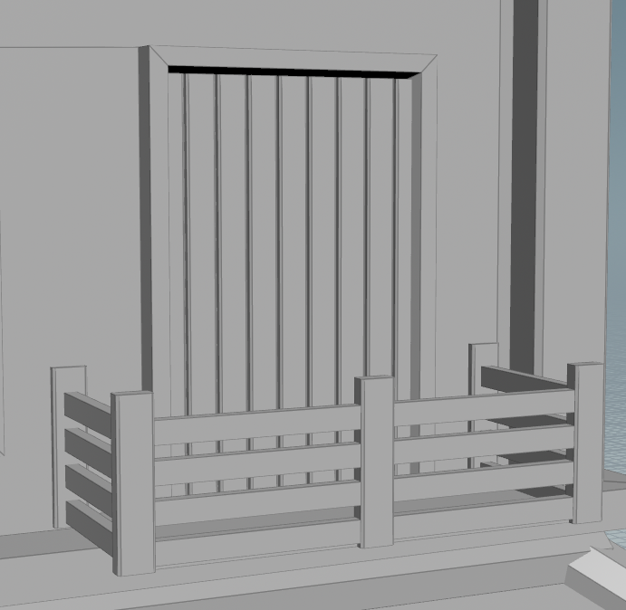

### Window
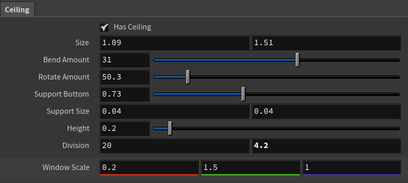

For the window, the users could control the scale of it. In addition, there is also an option to select whether to have a mini roof hanging over the windows, and the details of the mini roof can also be adjusted accordingly.

Window with mini roof             |  Window without mini roof
:-------------------------:|:-------------------------:
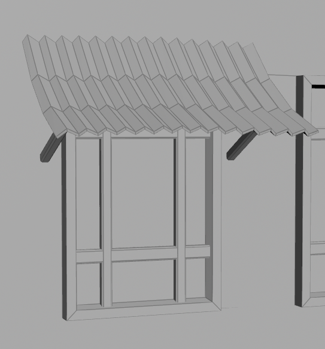  |  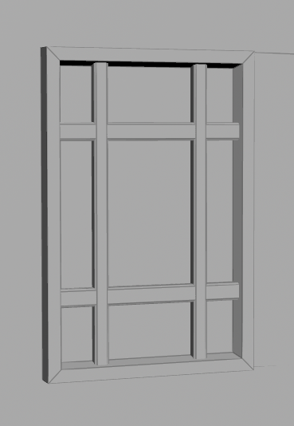

### Top Roof
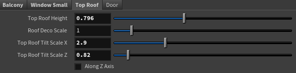

For the top part of the roof, the users could control the height, scale, tilt scale, and the axis to align the roof.

Door 
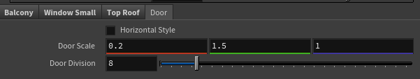

For the doors, the users could toggle between horizontal style and vertical scale, as well as adjust the scale and division.

Vertical Style             |  Horizontal Style
:-------------------------:|:-------------------------:
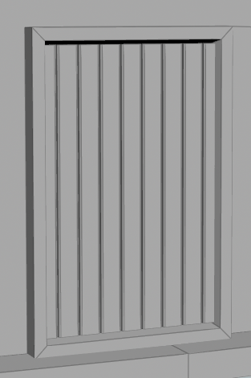  |  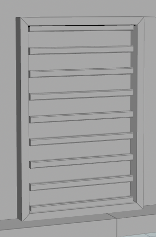